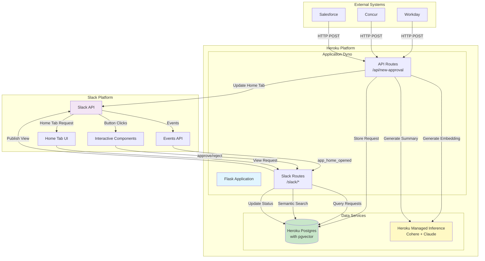
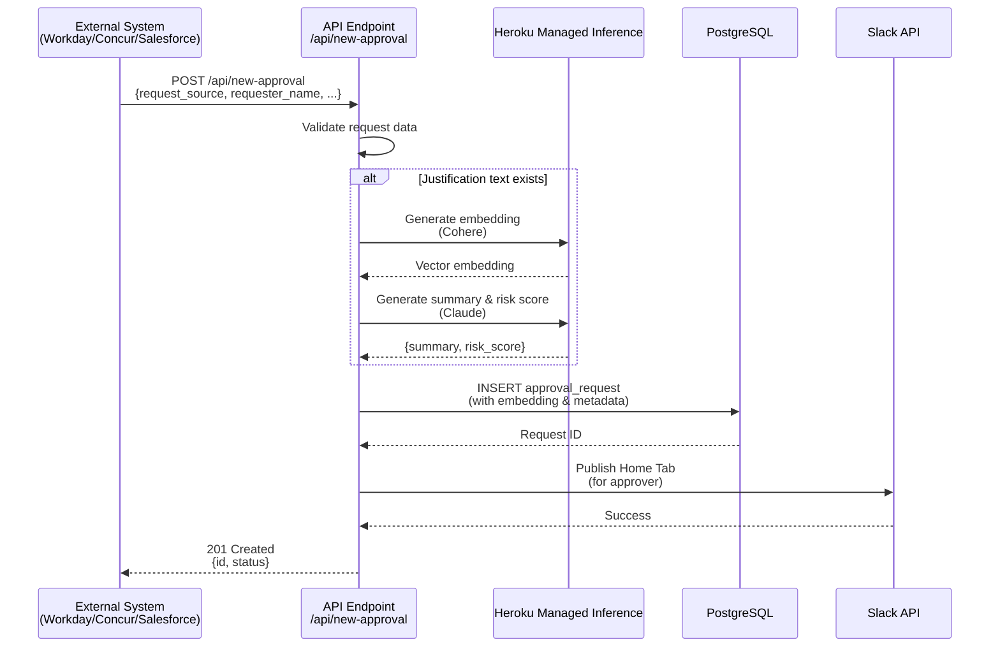
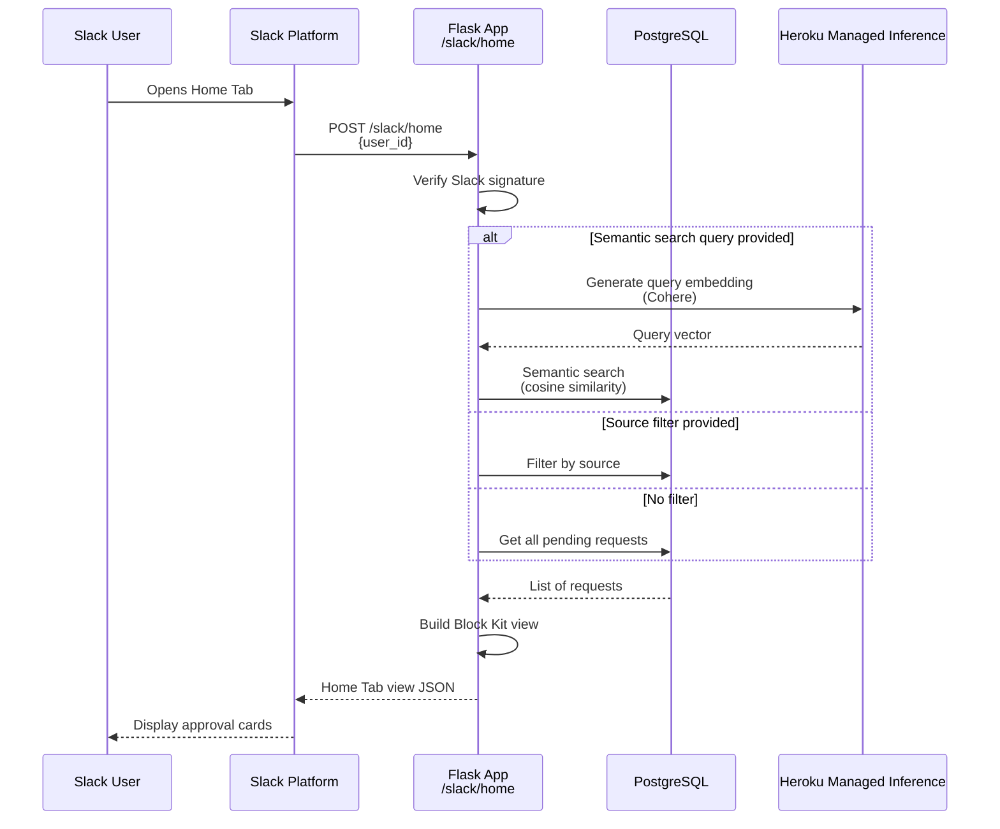
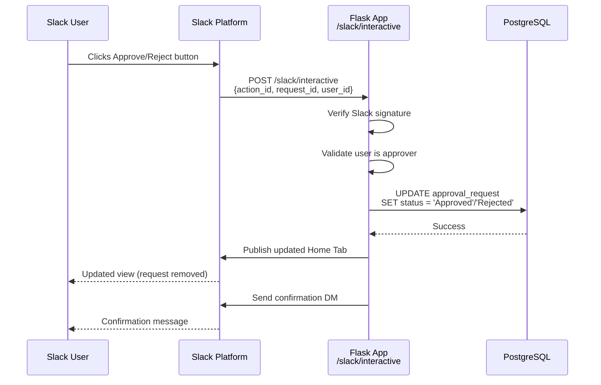
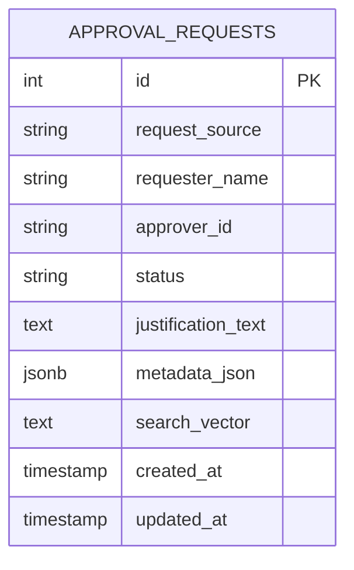
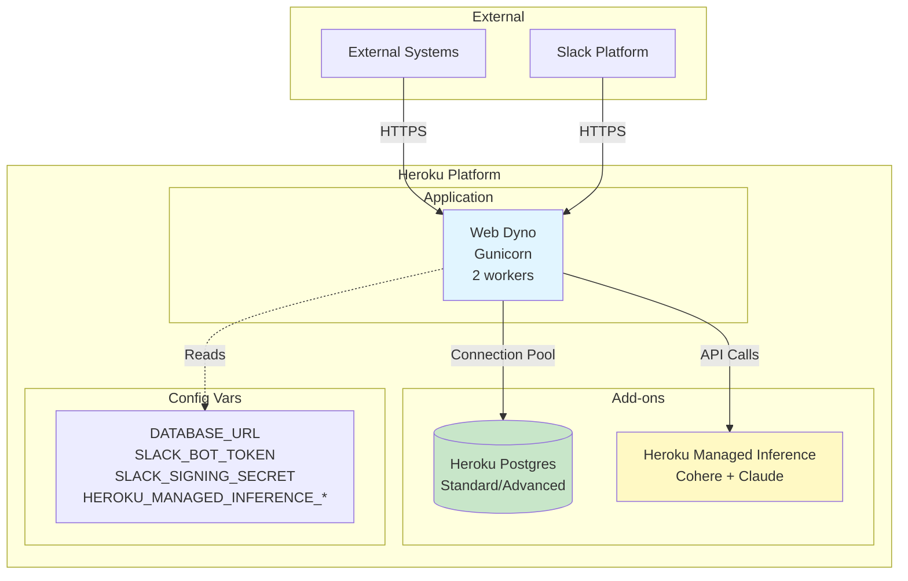

# Universal Approval Hub - Architecture Documentation

This document provides a comprehensive overview of the Universal Approval Hub architecture, including system components, data flow, and deployment architecture.

## Table of Contents

- [System Overview](#system-overview)
- [Architecture Components](#architecture-components)
- [System Architecture Diagram](#system-architecture-diagram)
- [Request Flow](#request-flow)
- [Database Schema](#database-schema)
- [Deployment Architecture](#deployment-architecture)
- [Technology Stack](#technology-stack)
- [Security Considerations](#security-considerations)
- [Scalability and Performance](#scalability-and-performance)

## System Overview

The Universal Approval Hub is a Flask-based web application that acts as a centralized approval system, integrating with multiple enterprise systems (Workday, Concur, Salesforce) and presenting approval requests through Slack. The application leverages AI/ML capabilities for semantic search, summarization, and risk scoring.

### Key Capabilities

- **Multi-Source Integration**: Accepts approval requests from Workday, Concur, and Salesforce via REST API
- **Slack Integration**: Displays approval requests in Slack Home Tab with interactive buttons
- **Web Interface**: User-friendly forms and status dashboard for workshops and demos
- **AI-Powered Features**: 
  - Semantic search using vector embeddings (Cohere)
  - Automatic summarization (Claude)
  - Risk scoring (Claude)
- **Real-Time Updates**: Instant UI updates when approvals are processed
- **Vector Search**: PostgreSQL with pgvector for semantic similarity search

## Architecture Components

### 1. Flask Application (`app.py`)

The main application entry point that:
- Initializes Flask and configuration
- Sets up database connections
- Registers API and Slack blueprints
- Handles error responses
- Provides health check endpoint

### 2. API Routes (`routes/api_routes.py`)

REST API endpoints for external system integration:
- `POST /api/new-approval`: Accepts approval requests from external systems
- Validates incoming data
- Generates embeddings and AI summaries
- Stores requests in database
- Updates Slack Home Tab

### 3. Slack Routes (`routes/slack_routes.py`)

Slack integration endpoints:
- `POST /slack/events`: Handles Slack Events API (URL verification, app_home_opened)
- `POST /slack/interactive`: Handles button clicks (approve/reject)
- `POST /slack/home`: Returns Home Tab view structure
- Verifies Slack request signatures
- Builds Block Kit UI components

### 4. Web Routes (`routes/web_routes.py`)

Web interface endpoints for workshops and demos:
- `GET /`: Landing page with app overview
- `GET /create-request`: Request creation form with dynamic metadata fields
- `GET /status`: Status dashboard showing all requests with filtering
- `GET /api/requests`: API endpoint for fetching requests with optional filters
- Provides user-friendly interface for creating test requests
- Real-time status dashboard with auto-refresh

### 5. Database Layer (`database.py`, `models.py`)

- **Database Initialization**: Sets up PostgreSQL connection, enables pgvector extension
- **Models**: SQLAlchemy ORM models for `ApprovalRequest`
- **Schema**: Single table with JSONB metadata and vector embeddings

### 6. AI/ML Integration (`utils/heroku_inference.py`)

Heroku Managed Inference integration:
- **Embeddings**: Cohere `embed-english-v3.0` for vector generation
- **Chat Completions**: Claude `claude-3-7-sonnet` for summarization and risk scoring
- Handles API authentication and error handling

### 7. Semantic Search (`utils/semantic_search.py`)

pgvector-based semantic search:
- Converts text queries to vector embeddings
- Performs cosine similarity search in PostgreSQL
- Returns ranked results by relevance

### 8. Slack Utilities (`utils/slack_utils.py`)

Helper functions for Slack API:
- Publishes Home Tab views
- Handles Slack WebClient initialization

## System Architecture Diagram



## Request Flow

### Flow 1: Creating an Approval Request



### Flow 2: Viewing Approval Requests (Home Tab)



### Flow 3: Approving/Rejecting a Request



## Database Schema

### Entity Relationship Diagram



### Table Structure

**`approval_requests`**

| Column | Type | Description |
|--------|------|-------------|
| `id` | INTEGER (PK) | Primary key, auto-increment |
| `request_source` | VARCHAR(50) | Source system: 'Workday', 'Concur', 'Salesforce' |
| `requester_name` | VARCHAR(100) | Name of the employee making the request |
| `approver_id` | VARCHAR(50) | Slack User ID of the approver |
| `status` | VARCHAR(20) | Request status: 'Pending', 'Approved', 'Rejected' |
| `justification_text` | TEXT | Free-text justification for the request |
| `metadata_json` | JSONB | Flexible JSON storage for source-specific data |
| `search_vector` | TEXT | Vector embedding for semantic search (stored as text, cast to vector in queries) |
| `created_at` | TIMESTAMP WITH TIME ZONE | Request creation timestamp |
| `updated_at` | TIMESTAMP WITH TIME ZONE | Last update timestamp |

### Indexes

- `request_source` (indexed for filtering)
- `approver_id` (indexed for user queries)
- `status` (indexed for status filtering)
- `search_vector` (vector index via pgvector for similarity search)

### Metadata JSON Structure

The `metadata_json` field stores source-specific data:

**Workday (PTO):**
```json
{
  "date_range": "2024-01-15 to 2024-01-19",
  "ai_summary": "Employee requesting 5 days of vacation",
  "risk_score": 2
}
```

**Concur (Expenses):**
```json
{
  "amount": 1250.00,
  "pdf_url": "https://...",
  "ai_summary": "Business travel expense",
  "risk_score": 4
}
```

**Salesforce (Deals):**
```json
{
  "customer_name": "Acme Corporation",
  "deal_value": 50000.00,
  "risk_score": 3,
  "ai_summary": "Standard enterprise deal"
}
```

## Deployment Architecture

### Heroku Deployment Diagram



### Deployment Components

1. **Web Dyno**
   - Runs Gunicorn with 2 workers (auto-configured based on memory)
   - Handles HTTP requests from external systems and Slack
   - Stateless application (all state in database)

2. **Heroku Postgres**
   - Primary data store
   - pgvector extension enabled for semantic search
   - Connection pooling configured (pool_size: 10-20, max_overflow: 20-40)
   - SSL required for production connections

3. **Heroku Managed Inference**
   - Provides Cohere embeddings API
   - Provides Claude chat completions API
   - Optional add-on (app works without it, but AI features disabled)

4. **Environment Variables**
   - `DATABASE_URL`: Automatically set by Heroku Postgres add-on
   - `SLACK_BOT_TOKEN`: Bot token from Slack app configuration
   - `SLACK_SIGNING_SECRET`: For verifying Slack request signatures
   - `HEROKU_MANAGED_INFERENCE_API_URL`: Inference API endpoint
   - `HEROKU_MANAGED_INFERENCE_API_KEY`: Inference API authentication

### Scaling Considerations

- **Horizontal Scaling**: Add more web dynos for increased throughput
- **Database Scaling**: Upgrade to Heroku Postgres Advanced for better performance
- **Connection Pooling**: Configured to handle concurrent requests efficiently
- **Worker Processes**: Gunicorn workers scale based on available memory

## Technology Stack

### Backend
- **Python 3.11.9**: Runtime language
- **Flask 3.0+**: Web framework
- **SQLAlchemy 2.0+**: ORM for database operations
- **Gunicorn**: WSGI HTTP server for production
- **psycopg2**: PostgreSQL adapter

### Database
- **PostgreSQL 12+**: Relational database
- **pgvector**: Vector similarity search extension

### AI/ML
- **Heroku Managed Inference**: Managed AI service
  - **Cohere embed-english-v3.0**: Text embeddings (1024 dimensions)
  - **Claude 3.5 Sonnet**: Chat completions for summarization

### Integration
- **Slack SDK**: Official Slack Python SDK
- **Slack Events API**: Real-time event handling
- **Slack Interactive Components**: Button interactions
- **Slack Home Tab**: App home interface

### Deployment
- **Heroku**: Platform as a Service
- **Heroku Postgres**: Managed PostgreSQL
- **Heroku Managed Inference**: Managed AI service

## Security Considerations

### 1. Request Verification

- **Slack Signature Verification**: All Slack requests are verified using HMAC-SHA256 signatures
- **Timestamp Validation**: Prevents replay attacks (5-minute window)
- **Signature Comparison**: Constant-time comparison to prevent timing attacks

### 2. Authentication & Authorization

- **Slack OAuth**: Bot token authentication for Slack API calls
- **User Authorization**: Only assigned approvers can approve/reject requests
- **Database Security**: Connection uses SSL/TLS encryption

### 3. Data Protection

- **Environment Variables**: Sensitive data stored in Heroku config vars
- **No Hardcoded Secrets**: All secrets loaded from environment
- **SSL/TLS**: All external connections use HTTPS
- **Database Encryption**: Heroku Postgres encrypts data at rest

### 4. Input Validation

- **JSON Schema Validation**: API endpoints validate required fields
- **SQL Injection Prevention**: SQLAlchemy parameterized queries
- **XSS Prevention**: Slack Block Kit sanitizes user input

## Scalability and Performance

### Database Optimization

- **Connection Pooling**: Reduces connection overhead
  - Pool size: 10-20 connections
  - Max overflow: 20-40 connections
  - Pool recycle: 3600 seconds
- **Indexes**: Strategic indexes on frequently queried columns
- **Vector Index**: pgvector index for fast similarity search

### Application Optimization

- **Worker Processes**: Gunicorn workers handle concurrent requests
- **Stateless Design**: Enables horizontal scaling
- **Efficient Queries**: Optimized SQL queries with proper joins
- **Caching Opportunities**: AI summaries cached in metadata (future enhancement)

### AI/ML Performance

- **Async Processing**: Embeddings and summaries generated asynchronously
- **Error Handling**: Graceful degradation if AI services unavailable
- **Timeout Management**: 30-second timeouts for API calls

### Monitoring

- **Health Check Endpoint**: `/health` for monitoring
- **Structured Logging**: JSON-formatted logs for analysis
- **Error Tracking**: Comprehensive error logging with context

## Future Enhancements

Potential improvements for production deployment:

1. **Caching Layer**: Redis for caching frequent queries
2. **Message Queue**: Background job processing for AI operations
3. **Rate Limiting**: API rate limiting for external systems
4. **Audit Logging**: Comprehensive audit trail for compliance
5. **Multi-Tenancy**: Support for multiple organizations
6. **Advanced Filtering**: More sophisticated filter options
7. **Notification System**: Email/SMS notifications for approvers
8. **Analytics Dashboard**: Approval metrics and insights
9. **Webhook Retry Logic**: Retry failed webhook deliveries
10. **A/B Testing**: Test different AI models and prompts

## Conclusion

The Universal Approval Hub demonstrates a modern, AI-powered integration architecture that centralizes enterprise approvals in Slack. By leveraging Heroku's managed services (Postgres, Managed Inference) and modern Python frameworks, the application provides a scalable, secure, and user-friendly approval workflow.

The architecture is designed to be:
- **Scalable**: Horizontal scaling with stateless design
- **Secure**: Comprehensive security measures
- **Maintainable**: Clean code structure and documentation
- **Extensible**: Easy to add new sources and features

For questions or contributions, please refer to the main [README.md](README.md) file.

